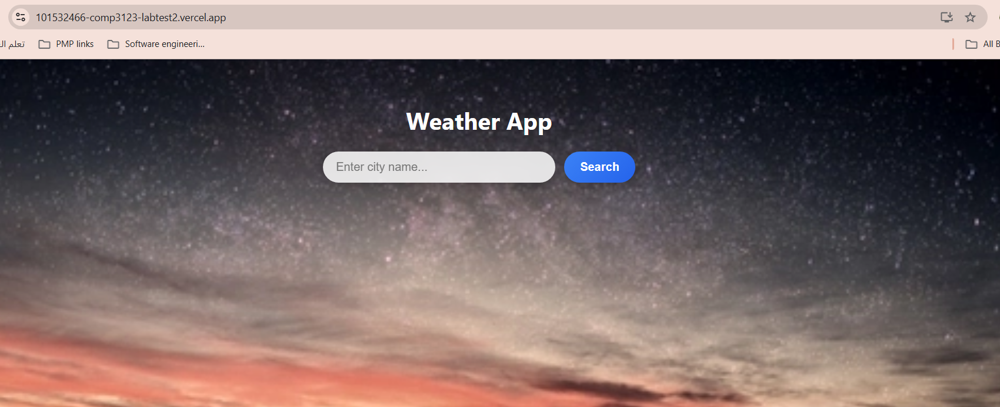
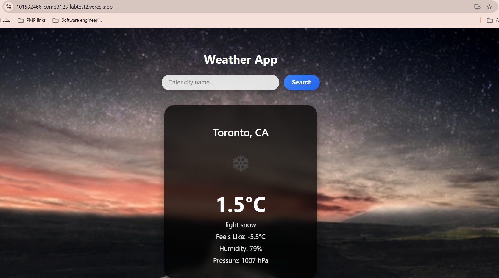

# 🌤 Weather App – COMP3123 Lab Test 2

**Student Name:** Adel Alhaj Hussein  
**Student ID:** 101532466  
**Course:** Full Stack Development I (COMP3123)  
**Instructor:** Pritesh Patel

This project is a React-based Weather Application where users can search for any city and view live weather conditions using the OpenWeatherMap API. The interface is styled with a custom theme, background, icons, and a modern UI.

---

## Live Deployment (Vercel Hosting)
https://101532466-comp3123-labtest2.vercel.app/

---

## Screenshots

### **Home Page**

### **Weather Result**

---

## 📡 API Used

**a099d304c2ce010154a9de748353a77f**

Weather Icons Reference:  
https://openweathermap.org/weather-conditions

Sample Icon:  
http://openweathermap.org/img/wn/10d@2x.png

---

## Technologies Used

- ReactJS (Create React App)
- JavaScript (ES6 features)
- Fetch API
- OpenWeatherMap API
- CSS for styling
- Vercel for deployment

---

## 🎨 Features

- Search for weather by city name
- Displays:
    - Temperature (°C)
    - Weather icon
    - Description
    - Feels like
    - Humidity
    - Wind speed
    - Pressure
- Custom background image and themed layout
- Responsive UI
- Dynamic rendering using props, state, and hooks

---

## 🧩 How to Run This Project Locally

1. Clone the repository:

